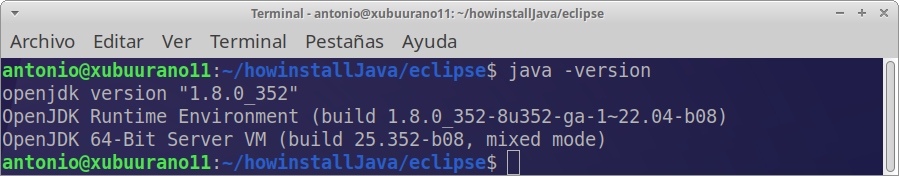
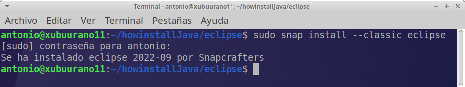
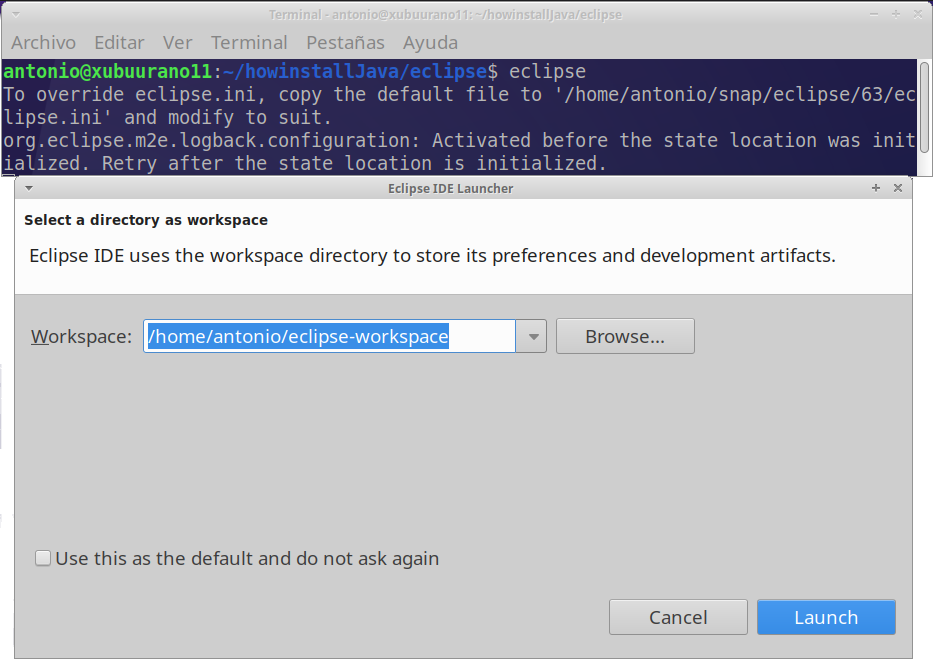

# Tarea 10.- instalación de Eclipse

* Autor: Antonio Hernández Domínguez
* Curso: 1º DAW 2022/2023
* Asignatura: Entornos de desarrollo
* Tema 3: Instalación y uso de entornos de desarrollo

***

<div align="justify">

# Indice

## [1. Introducción](#id0)
## [2. Instalación del IDE Eclipse](#id1)
## [3. Lanzamiento Eclipse](#id2)

# Introducción <a name="id0"></a>


# Instalación del IDE Eclipse<a name="id1"></a>

<div align="center">
  
</div>

  Eclipse es uno de los IDE de código abierto más populares (Iintegrado Ddesarrollo minvironment) para desarrolladores de software. Es popular para aplicaciones basadas en Java, también se usa para C / C ++, PHP y Perl y otros proyectos web.

  Recuerda que para la instalación de __Eclipse__ debes de tener instalado __Java__. Los pasos para realizar su instalación y configuración se encuentra en el siguiente [enlace](tarea-jdk.md).

  Para verificarlo recuerda ejecutar el siguiente enlace:

  ```console
  java -version
  ```


## Instalación

  Los paquetes Snap son paquetes de software universales prediseñados que se envían con las bibliotecas y dependencias requeridas por el paquete de software. Son independientes de la distribución y se pueden instalar en cualquier distribución principal de Linux. Los snaps son populares ya que no requieren ninguna dependencia durante la instalación, lo que hace que el proceso de instalación sea fluido y sin errores.

  Para instalar la edición Community, ejecute el siguiente comando:

  ```console
  sudo snap install --classic eclipse
  ```

  


  Esto debería llevar unos minutos y debería continuar sin problemas.

  ### Lanzamiento de Eclipse<a name="id2"></a>

  Para iniciar Eclipse en Ubuntu, use la aplicación para buscarlo (_Activities o Alt + F1_) como se muestra. Luego haga clic en el ícono de Eclipse.

  Busca un icono similar al siguiente, dado que puede sufrir modificaciones en función de la versión:

  

</div>
