# Tarea 7.- instalación de Java en el SO
* Autor: Antonio Hernández Domínguez
* Curso: 1º DAW 2022/2023
* Asignatura: Entornos de desarrollo
* Tema 3: Instalación y uso de entornos de desarrollo
***

<div align="justify">

# Indice

## [1. Introducción](#id0)
## [2. Creamos el repositorio "howinstallJava](#id1)
### [2.1 Creamos el par de claves](#id2)
### [2.2 Clonamos el repositorio en local](#id3)
## [3. Instalación de JDK en Ubuntu](#id4)
## [4. ¿Cómo instalar una versión específica de Java?](#id5)
## [5. Configuración de las variables de entorno](#id6)


## Introducción

Java sin dudas es un lenguaje de programación que es utilizado para diversos propósitos y es un complemento casi esencial para la ejecución y funcionamiento de diversas herramientas, la instalación de java es prácticamente una tarea esencial después de haber realizado la instalación de este.

Es por ello que en esta ocasión compartiré con ustedes un sencillo tutorial de como instalar Java en nuestro sistema con el JDK el cual es un entorno de desarrollo y el entorno de ejecución JRE.


## Creamos el repositorio "howinstallJava"

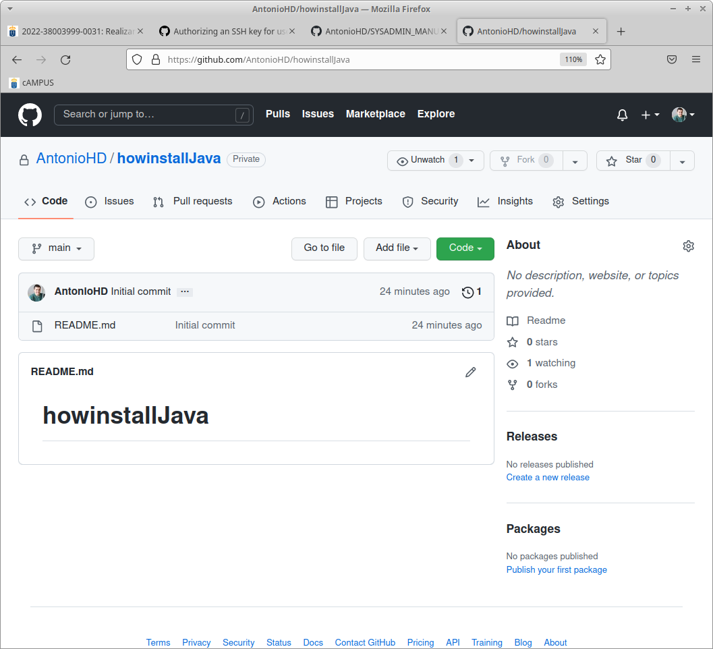
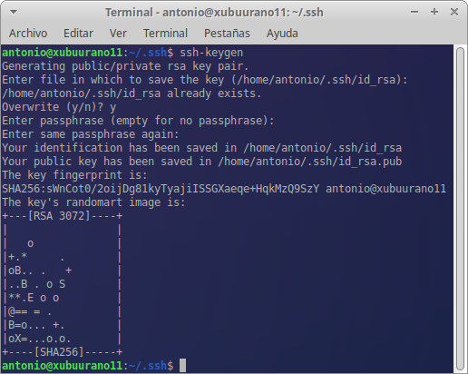
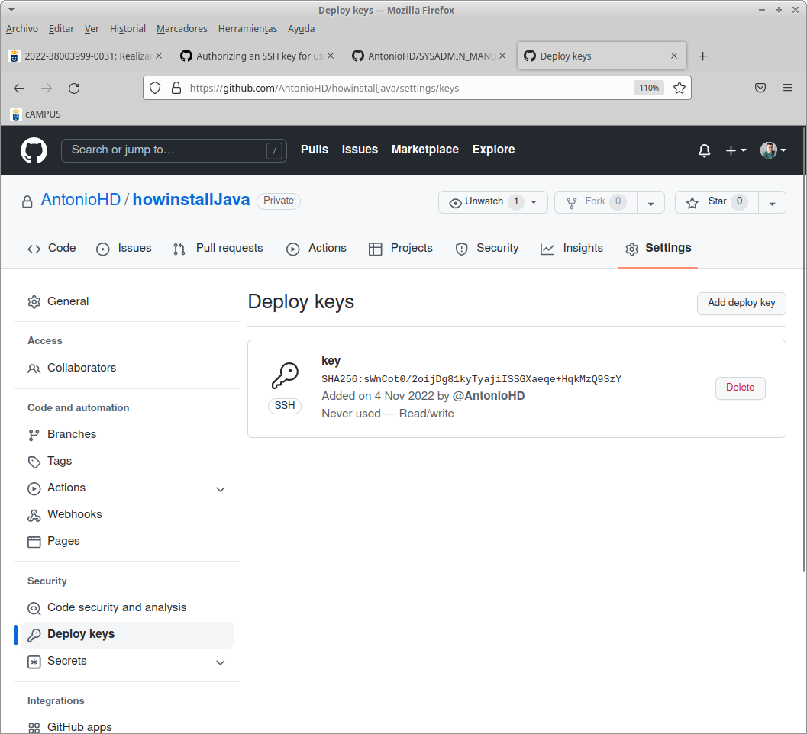
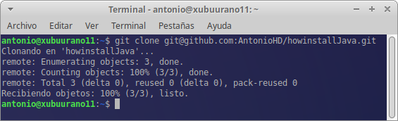
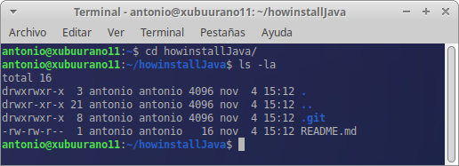
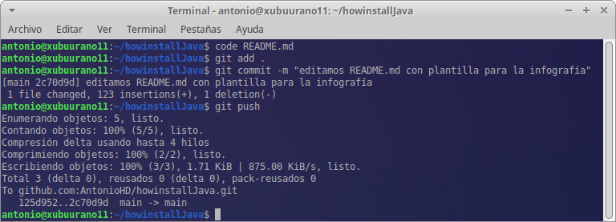


## ¿Cómo instalar Java en Ubuntu desde repositorios?

Lo primero debemos de actualizar el sistema con:

```
  sudo apt-get update
```

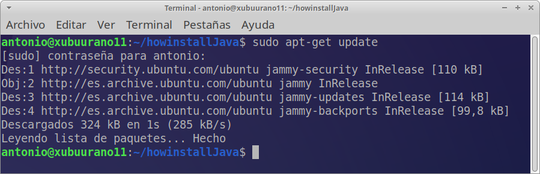

e instalamos Java con este comando:

```
  sudo apt-get install default-jdk
```

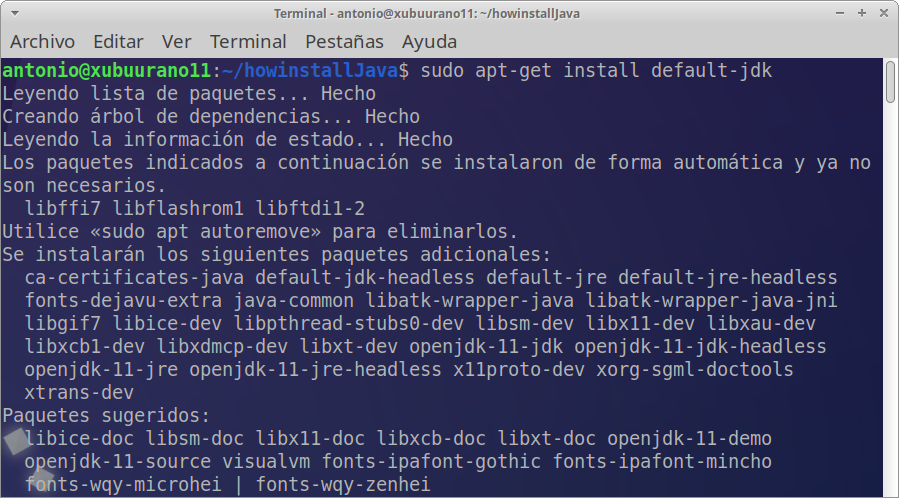

comprobamos que tenemos instalado Java en nuestro sistema solo debemos de ejecutar:
```
  java --version
```

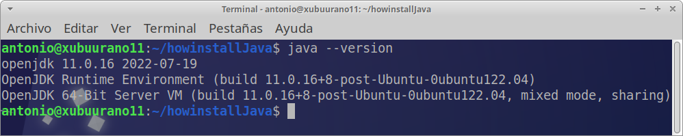

## ¿Cómo instalar una versión específica de Java?

Para instalar Ubuntu Java Open JDK ("la que utilizaremos en 1º").
 - OpenJDK:
   - 11
   ```
   sudo apt install openjdk-11-jdk
   ```
    - 13
   ```
   sudo apt install openjdk-13-jdk
   ```
    - 8
   ```
   sudo apt install openjdk-8-jdk
   ```

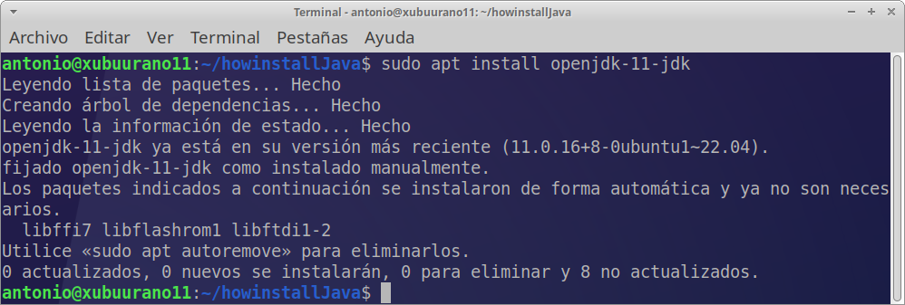
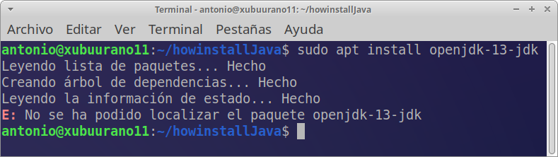
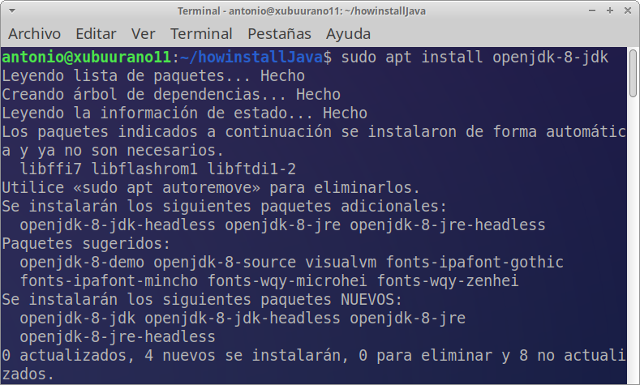

La versión que se debe de trabajar es la versión 8. Para ello verificaremos la versión de java que se esta ejecutando con la sentencia:

```console
  java --version
```

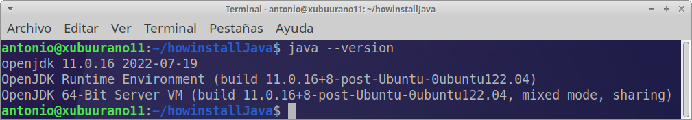

En caso que no se ejecuta la versión 8 se debe configurar las variables de entorno.

## Configuración de las variables de entorno

 El siguiente paso consiste en establecer  las variables de entorno. Es necesario porque cuando se usa Java, Linux necesita saber dónde está ubicado el programa para ejecutarlo y qué versión de Java usar de forma predeterminada. Para modificar esto, usaremos el editor de texto nano. Primero, abra el archivo en Nano.

### Listar la versiones de OpenJDK instaladas

 Ejecuta el siguiente comando para verificar que se han descargado las diferentes versiones de OpenJDK.

```console
 ls /usr/lib/jvm
```

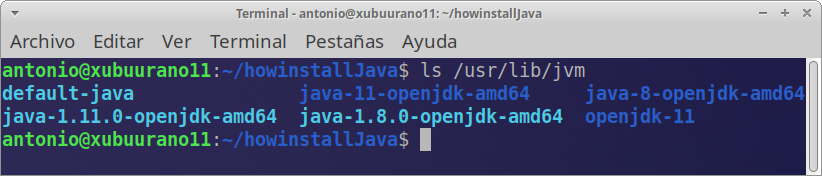

### Actualización de las variables de entorno

 Edita y modifica el fichero profile, con los comandos:

```console
sudo update-alternatives --config java
```
 y selecciona la version _8_.


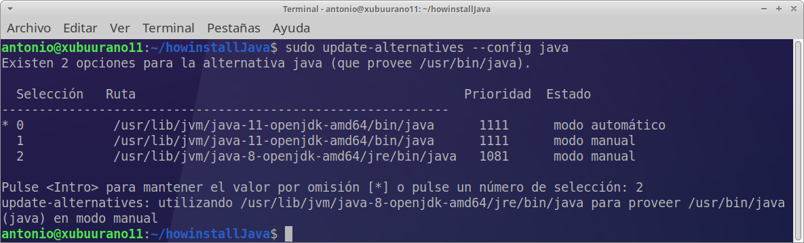

 Otra opción es : añadir el siguiente código:

```console
# Java version
JAVA_HOME=/usr/lib/jvm/(SELECCIONA UN PATH DE LA VERSION QUE DESEAS QUE SE EJECUTE)
PATH=$PATH:$HOME/bin:$JAVA_HOME/bin
export JAVA_HOME
export JRE_HOME
export PATH
```

 en

```console
/etc/profile.d/java.sh
```

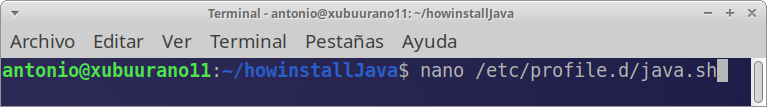
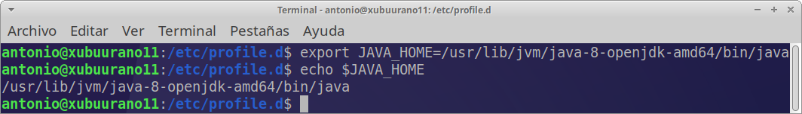

Haga que el script sea ejecutable con chmod:

```console
sudo chmod +x /etc/profile.d/java.sh
```

Finalmente, cargue las variables de entorno usando el comando de source

```console
source /etc/profile.d/java.sh
```

## Trabajando con git

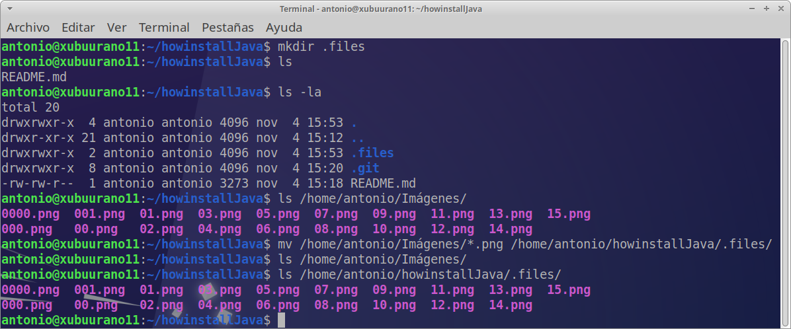
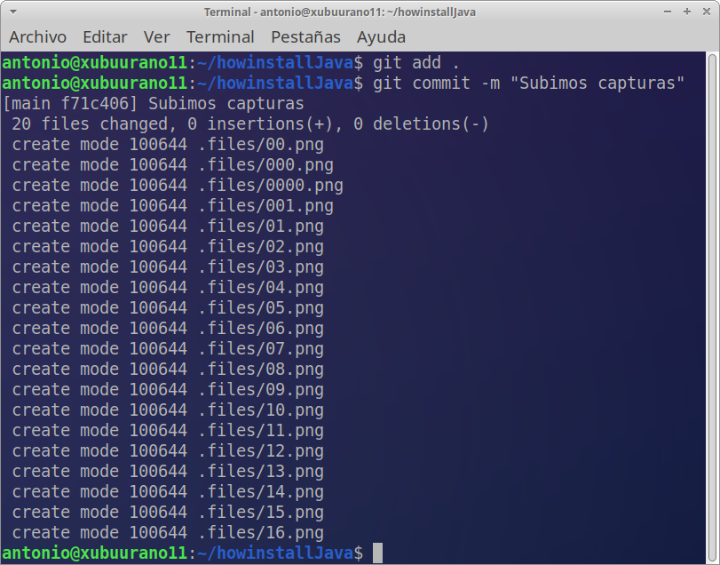
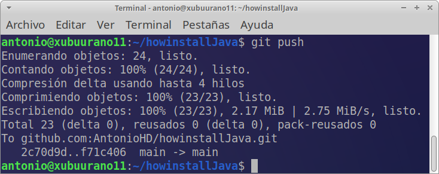