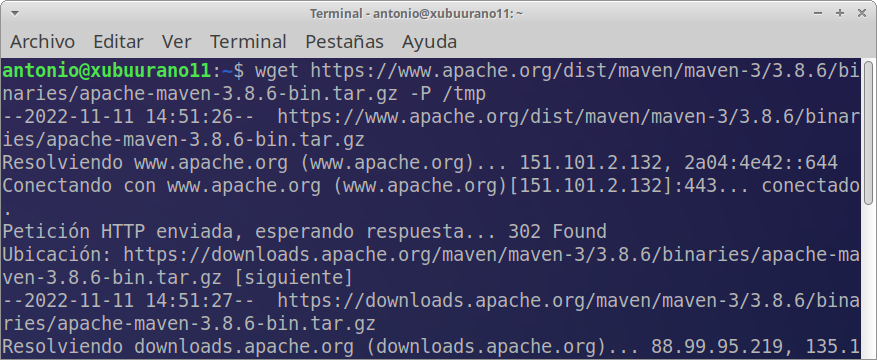

# Instalación de Maven en el SO

# Tarea 8.- instalación de Maven en Ubuntu

* Autor: Antonio Hernández Domínguez
* Curso: 1º DAW 2022/2023
* Asignatura: Entornos de desarrollo
* Tema 3: Instalación y uso de entornos de desarrollo

***

<div align="justify">

# Indice

## [1. Introducción](#id0)
## [2. Instalar Apache Maven](#id1)
### [2.1 Instalar Apache Maven con apt](#id2)
### [2.2 Instalar una versión concreta de Apache Maven](#id3)
## [3. Establecer variables de entorno](#id4)
## [4. Verificar la instalación](#id5)

## Introducción <a name="id0"></a>

 Apache Maven es una herramienta de gestión y comprensión de proyectos de código abierto que se utiliza principalmente para proyectos Java. Maven usa un modelo de objetos de proyecto (POM), que es esencialmente un archivo XML que contiene información del proyecto, detalles de configuración, dependencias del proyecto y más.

## Instalar Apache Maven <a name="id0"></a>

### Instalar Apache Maven con apt <a name="id1"></a>

 Instalar Maven en Ubuntu usando apt es un proceso simple y directo.

 Actualice el índice del paquete e instale Maven ingresando los siguientes comandos:

```
 sudo apt update
```


```
 sudo apt install maven
```


 Para verificar la instalación, ejecute mvn -version:

```
 mvn -version
```

 La salida debería verse de forma similar:

```
Apache Maven 3.6.3
 Maven home: /usr/share/maven
 Java version: 11.0.7, vendor: Ubuntu, runtime: /usr/lib/jvm/java-11-openjdk-amd64
 Default locale: en_US, platform encoding: UTF-8
 OS name: "linux", version: "5.4.0-29-generic", arch: "amd64", family: "unix"
```


 Eso es todo. Maven ahora está instalado en su sistema y puede comenzar a usarlo.


### Instalar una versión concreta de Apache Maven <a name="id2"></a>

 En el momento de escribir este artículo, es la última versión de Apache Maven 3.8.6. Antes de continuar con el siguiente paso, visite la página de descarga de Maven para ver si hay una versión más nueva disponible.

 

 Descargue Apache Maven en el directorio /tmp:

```
wget https://www.apache.org/dist/maven/maven-3/3.8.6/binaries/apache-maven-3.8.6-bin.tar.gz -P /tmp
```



 Una vez que se complete la descarga, extraiga el archivo en el directorio /opt

```
sudo tar xf /tmp/apache-maven-*.tar.gz -C /opt
```


 Para tener más control sobre las versiones y actualizaciones de Maven, que a crear un maven enlace simbólico que apunte al directorio de instalación de Maven:

```
sudo ln -s /opt/apache-maven-3.8.6 /opt/maven
```


 Cuando se lanza una nueva versión, puede actualizar su instalación de Maven desempaquetando la última versión y cambiando el enlace simbólico para señalarla.


## Establecer variables de entorno <a name="id3"></a>

 A continuación, necesitaremos establecer las variables de entorno. Para hacer esto, abra su editor de texto y cree un nuevo archivo llamado mavenenv.sh en el directorio /etc/profile.d/

```
sudo nano /etc/profile.d/maven.sh
```

Pega el siguiente código:

```
 export M2_HOME=/opt/maven
 export MAVEN_HOME=/opt/maven
 export PATH=${M2_HOME}/bin:${PATH}
```

 Guarde y cierre el archivo. Este script se utilizará al iniciar el shell.

 

 Haga que el script sea ejecutable con chmod:

```
 sudo chmod +x /etc/profile.d/maven.sh
```
 Finalmente, cargue las variables de entorno usando el comando de source
```
 source /etc/profile.d/maven.sh
```


## Verificar la instalación <a name="id4"></a>

Para verificar que Maven está instalado, use el mvn -version que imprimirá la versión de Maven:

```
mvn -version
```

Debería ver algo similar a lo siguiente:

```
Apache Maven 3.8.6 (cecedd343002696d0abb50b32b541b8a6ba2883f)
 Maven home: /opt/maven
 Java version: 11.0.7, vendor: Ubuntu, runtime: /usr/lib/jvm/java-11-openjdk-amd64
 Default locale: en_US, platform encoding: UTF-8
 OS name: "linux", version: "5.4.0-29-generic", arch: "amd64", family: "unix"
```


Eso es todo. La última versión de Maven ahora está instalada en su sistema Ubuntu.

Conclusión

Le mostramos cómo instalar Apache Maven en Ubuntu. Ahora debería visitar la página de documentación oficial de Apache Maven y aprender cómo empezar con Maven.